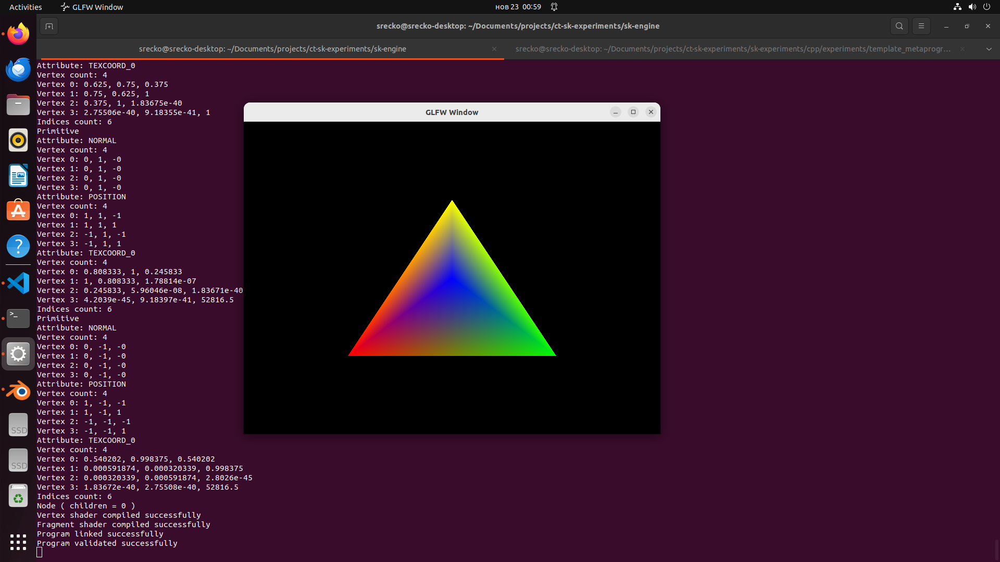
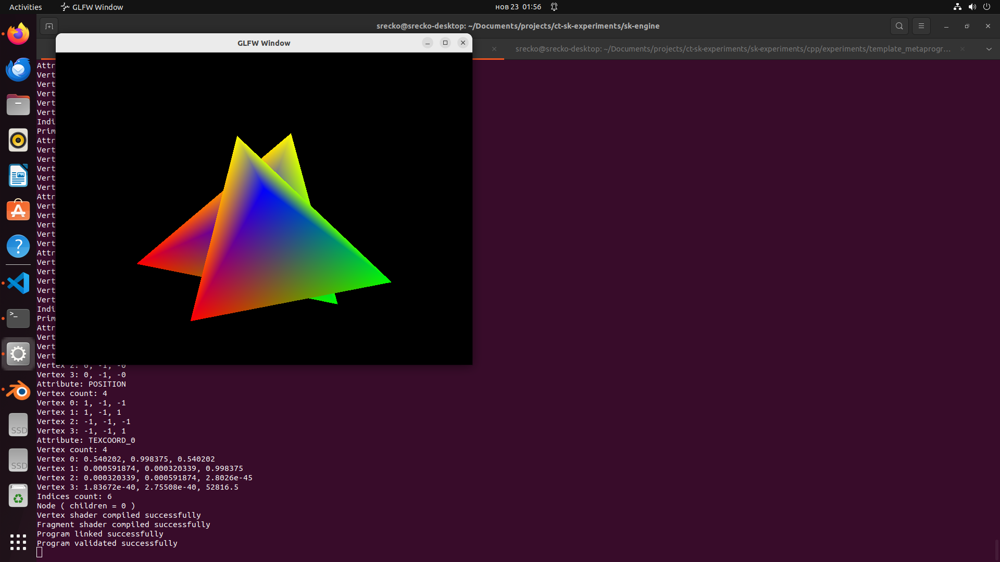
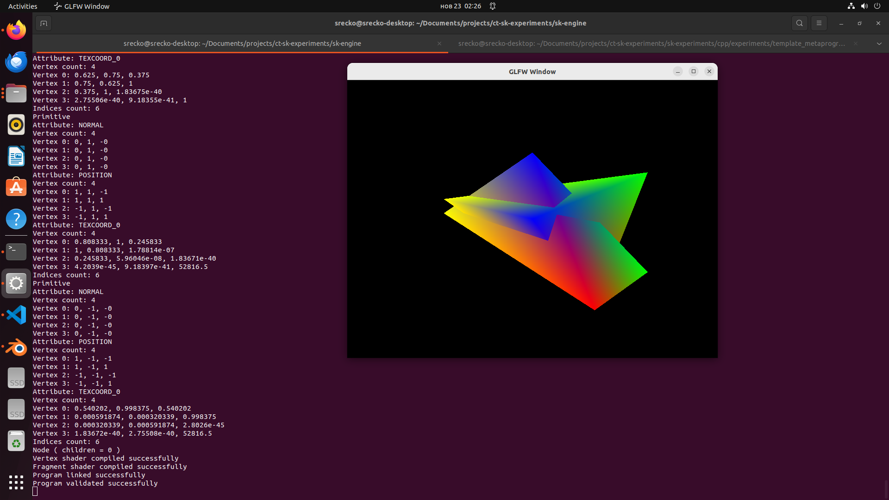

# tinygltf model

Import the model using tinygltf to see explore the alternative.

I immediately noticed there are no UV flipping and triangulation features.

That means I would need to handle them while I have no clue about either of the two at the moment.

## Issue commands through command line interface to a custom renderer

An idea is to implement client and server side. A client side to issue commands through a command line interface to a server side that relays events to the client that listens for events and draws in response to events.

That situation simulates remote rendering.

## Decision

I think between the two, I would go with assimp.

That library offers more features and I have to do less work. With tinygltf, I can load gltf model's data, but I have to figure out a lot of things. In the end, i feel like it will be roughly similar amount of effort. I see that both libraries simply provide me vertex, matrix, and other data that I have to figure out how to interpret.

Computer graphics is simply storing, loading, modifying, and more of vertex data... I didn't think it was like this when I started this project.

However the thought of that excites me!

See as many angles as possible!

## Conclusion on how to learn OpenGL

- Solve many problems using OpenGL.
- Create a lot of software using OpenGL.
- Use every OpenGL:
  - method
  - function
  - mathematical equation
- think of problems that OpenGL can solve, and solve them using OpenGL.
- Create something worthy.
- I want to create renderer that I can control through command line interface using a server and client architecture.

## Pictures

This damn thing got me hyped:

## How do I come up with this?

See [conversation](./conversation/) with ChatGPT on what questions I ask and how I respond to his queries.
